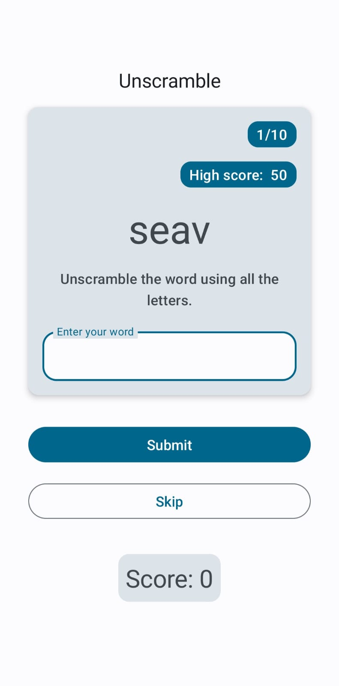
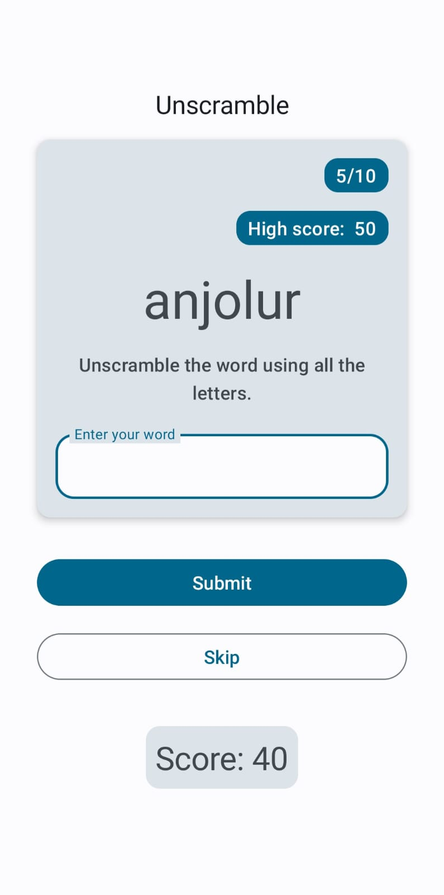
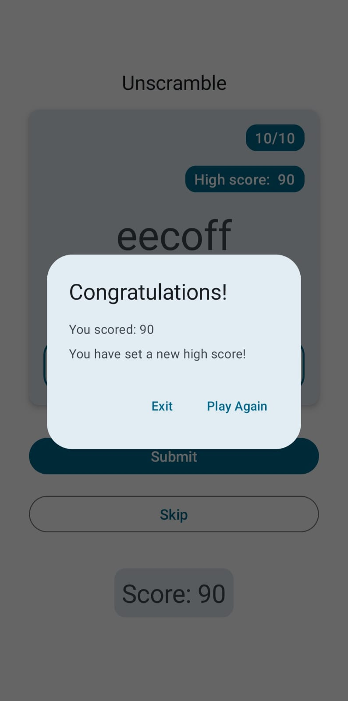

# Unscramble

**Unscramble** is a word puzzle game that challenges players to put their vocabulary and problem-solving abilities to the test. Players are presented with a jumbled word and tasked with rearranging its letters to form the correct word. 

One of the highlights of **Unscramble** is its scoring system, which rewards players based on the length of the words they unscramble. However, if a word is too difficult for the user to guess, they can skip the word. There are a total of 10 words in each session of the game.

If you manage to surpass your previous high score, a new high score is set and in stored in the phone's storage
so that the next time you play, the bar is set higher for you beat!

### Technologies Used

1. Kotlin
2. Jetpack Compose
3. Coroutines (for asynchronous updates to database)
4. Room library (for data persistence)

### Architecture followed
MVVM (Model-View-ViewModel) architecture pattern

## Screenshots

    
    
    

## Getting Started

1. Click on 'Code'. 
2. In the popup, click the 'Download ZIP' button.
3. Unzip the file.
4. Start 'Android Studio'.
5. In the 'Welcome to Android Studio window', click 'Open'.
6. Click the 'Run' button to build and run the app.

### Prerequisites
1. Make sure 'Android Studio' is installed on your computer.
2. An Android phone or virtual device with API 24 or above.

## Acknowledgements

This project incorporates elements from Google's codebase, 
licensed under the Apache License, Version 2.0. 

The majority of the project comprises original code developed by Syed Mohammed Ibrahim Ali.

## Contact

Email id: ibrahimali@tuta.io
